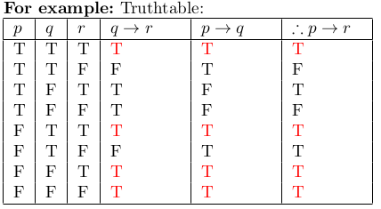

# LAB 5

## 1 Given

P ="You get good grade in the midterm exam"

Q ="You understand how to solve all the exercises in the book"

Print the Propositional form of the following statements:

- (a) You get good grade in the midterm exam if you understand how to solve all the exercises in the book, and if you will get good grade in the midterm exam means you understand how to solve all the exercises in the book.

- (b) You understand how to solve all the exercises in the book, but you did not get good grade in the midterm exam

- (c) By understand how to solve all the exercises in the book, you will get good grade in the midterm exam

## 2. Print the statements from **Exercise 1.** in "if ... then ... " or "... if and only if ..." natural language form

## 3. Print the negation, converse and contrapositive of the "if ... then ..." statements you print from **Exercise 2.** in Propositional form and natural language respectively

## 4. Print the following items in logical propositional argument form

- (a) Let:p="Phong has Visa"; q="Phong can fly"; r="Phong can speak
English"; t="Phong goes to america"

```bash
Given:
P ="Phong has Visa"
S1="If Phong can fly, Phong will go to America"
S2="If Phong has Visa, Phong will go to America"
S3="If Phong can speak English, Phong will go to America"
Conclusion : C ="Phong goes to America"
```

- (b) Let: p ="An wake up late"; q ="the traffic is flowing smooth";
¬q ="the traffic is heavy"; r ="school day";s ="An have go to
school",v ="An is late for school"

```bash
Given:
P ="An wake up late"; Q ="The traffic is flowing smooth"
S1="The traffic is always heavy on school day"
S2="If An wake up late, he will be late for school on school day"
S3="An only have to go to school on school day"
S4="If An don’t have to go to school, An can’t be late for school"
Conclusion : C ="An is late for school"
```

For example:: Let: p ="Tam is smart"; q ="Tam does good on test";
r ="Tam has good score"

```bash
Given:
S1:"If Tam do good on exam, he will have good score"
S2:"If Tam is smart, he will do good on exam"
Conclusion: "If Tam is smart, he will have good score"
```

Then we do:

```python
S1 = "q - > r "
S2 = "p - > q "
C = "p - > r "
print ( " % s \ n % s \ n . % s " % ( S1 , S2 , C ) )
```

## 5. Print the truth table (Refer to Lab2 for the methodology) of the arguments from the previous Exercise 4. then Prove/Disprove them using others proof technique based on the truth table result



Prove:

```python
S1 = "q - > r "
S2 = "p - > q "
C = " S1 + S2 -> C = ’p - > r ’, Transitive "
print ( " S1 = % s " % ( S1 ) )
print ( " S2 = % s " % ( S2 ) )
print ( " % s " % ( C ) )
```

## 6. Given the following matrix

```python
A=[
[2 ,0 ,5 ,0 ,3 , 0 ] ,
[3 ,0 ,0 ,0 ,0 , 0 ] ,
[0 ,6 ,2 ,0 ,5 , 0 ] ,
[3 ,0 ,9 ,0 , 25 , 0 ] ,
[0 ,0 ,2 ,4 ,5 , 0 ] ,
[0 ,0 ,0 ,0 ,0 , 5 ]
]
```

And the following definitions:

isOdd(a):"a is an Odd number"

isPrime(a):"a is a Prime number"

isSquare(a):"a is a Square number"(sqrt(a) ∈ Z)

isGreater(a,b):"a>b"

isEqual(a,b):"a=b"

isAbove(a,b):"row(a) < row(b)"(A[i][j] has row = i and col = j)

isLeftOf(a,b):"col(a) < col(b)"

Write a function for each definition above then checking the following
statements’ correctness:

- (a) ∃a ∈ A, ¬isOdd(a) ∧ isP rime(a)
- (b) ∀a ∈ A, isOdd(a) → isSquare(a)
- (c) ∀a ∈ A, isOdd(a) → isGreater(a, 2)
- (d) ∃a ∈ A, isP rime(a) → ¬(isGreater(a, 3) ∨ isEqual(a, 3))
- (e) ∃a ∈ A, ∀b ∈ A, isLef tOf (a, b)
- (f) ∃a ∈ A, ∀b ∈ A, isGreater(a, b) → ¬isAbove(a, b)
- (g) ∀a ∈ A, ∃b ∈ A, isP rime(a) ∧ ¬isOdd(a) ∧ isOdd(b) → isAbove(a, b)
- (h) ∀a, b ∈ A, isSquare(a) ∧ isEven(a) ∧ isEven(b) ∧ ¬isEqual(a, b)
→ isLef tOf (b, a)

**Note:** rows and columns of the matrix start from 0 when programming
in python
